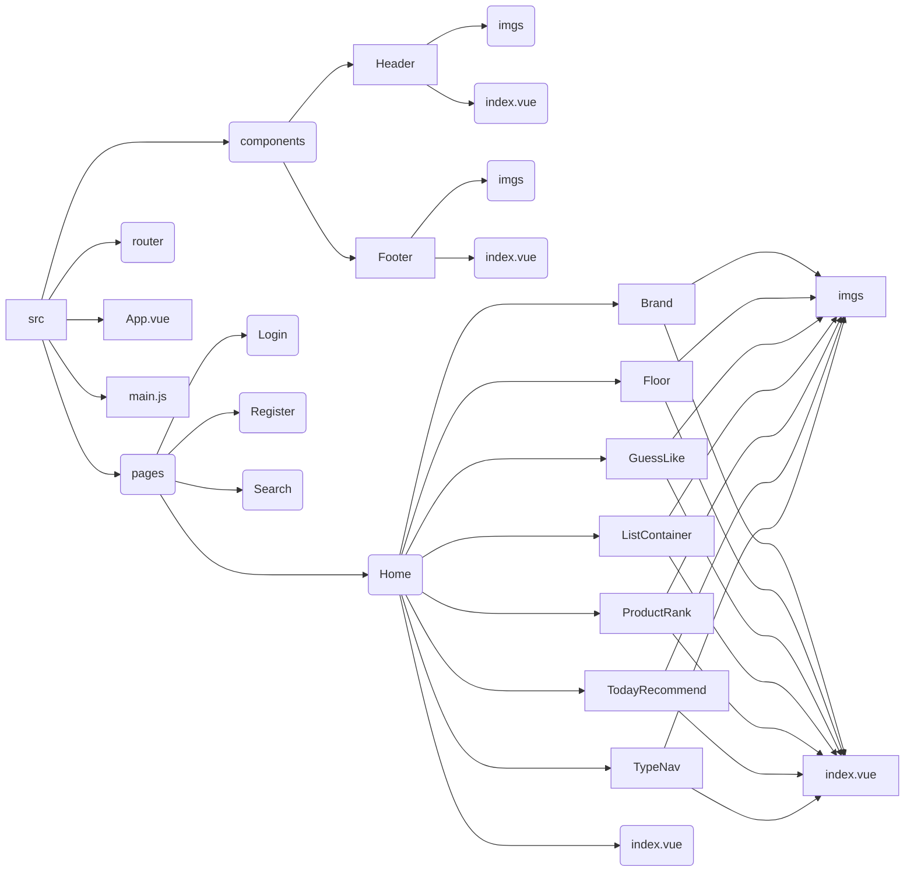
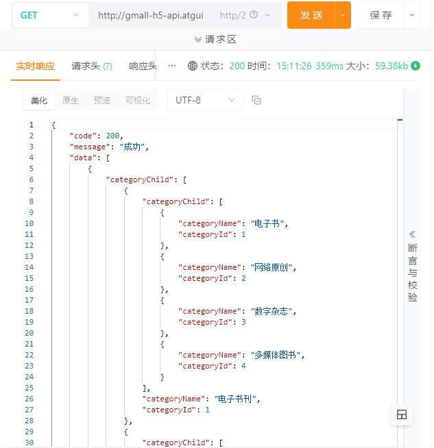
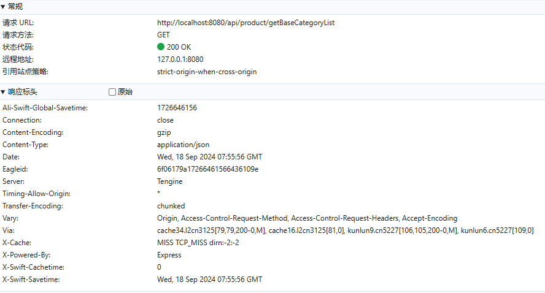
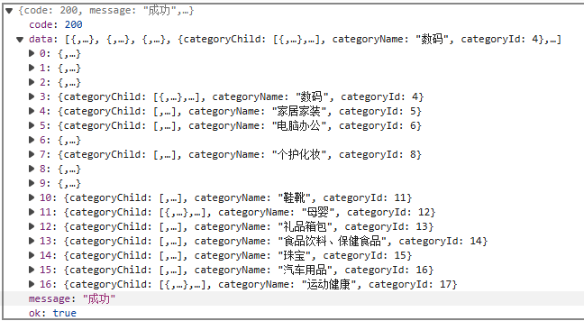

> ###### Home模块组件拆分
>
> 1. 静态界面完成
> 2. 拆分静态组件
> 3. 获取服务器的数据进行展示
> 4. 动态业务

## 三级联动组件（TypeNav）

由于三级联动组件在Home、Search、Detail都显示，所以将其注册为全局组件。好处是只需要注册一次，就可以在项目的任意地方进行使用。同时，由于TypeNav组件为全局组件，所以一般将其放置在components文件夹下。

在`main.js` 中注册全局组件：TypeNav：

```js
import Vue from 'vue'
import App from './App.vue'

// 三级联动组件（全局组件）
import TypeNav from '@/components/TypeNav'
Vue.component(TypeNav.name, TypeNav)

Vue.config.productionTip = false

// 引入路由
import router from '@/router'

new Vue({
  render: h => h(App),

  // 注册路由
  router
  
}).$mount('#app')
```

在Home组件中添加 TypeNav 标签，因其已经是全局组件了，所以不需要再import导入。

```vue
<template>
    <div>
        <!-- 三级联动全局组件，不需要再import引入 -->
        <TypeNav></TypeNav>
    </div>
</template>

<script>
export default {
    name: 'HomeIndex'

}
</script>

<style>

</style>
```


## 拆分静态组件




## 接口

### Apipost测试接口

- 服务器地址（最新）：http://gmall-h5-api.atguigu.cn

- 接口地址：/api/product/getBaseCategoryList

- 测试接口 = 服务器地址 + 接口地址 = http://gmall-h5-api.atguigu.cn/api/product/getBaseCategoryList 

经过测试，如下图所示，接口没有问题，更多接口地址详见文档 [接口文档 .doc](static_pages_copy\接口文档 .doc) 



**注意**：

1. 如果服务器返回的`code`字段是200，代表服务器返回数据成功
2. 整个项目，接口的前缀都有 `/api/` 字样


### Axios二次封装

- 请求拦截器：可以在发送请求之前处理一些业务
- 相应拦截器：当服务器数据返回以后，可以处理一些事情

安装Axios

```bash
npm install --save axios
```

在项目文件夹中，经常会出现`API`文件夹，一般都是关于`axios`的。

```js
// src/api/request.js

// 对于axios进行二次封装
import axios from "axios";

// 利用axios对象的方法create，去创建一个axios实例
// requests就是axios，只不过稍微配置一下
const requests = axios.create({
  // 配置对象
  // 基础路径，发请求的时候，路径当中会出现api
  baseURL: "/api",
  // 请求超时时间
  timeout: 5000,
});

// 请求拦截器：在发请求前，请求拦截器可以检测到，可以在请求发出去之前做一些事情
requests.interceptors.request.use(
  (config) => {
    // config 配置对象，里面有一个属性很重要，headers请求头
    return config;
  },
  (err) => {
    // 请求失败
    return err;
  }
);

// 响应拦截器
requests.interceptors.response.use(
  (res) => {
    // 成功的回调函数，服务器响应数据回来以后，响应拦截器可以检测到，可以做一些事情
    return res.data;
  },
  (err) => {
    // 失败的回调函数
    return Promise.reject(new Error("fail"));
  }
);

export default requests;
```


### API接口统一管理

- 项目很小时，完全可以在组件的生命周期函数中发送请求

- 项目很大时，需要将接口统一管理，当项目发生改变时，减少工作量

```js
// src/api/index.js

// 当前这个模块，是对所有的api进行统一管理

import requests from './request'

// 三级联动的接口
// 请求地址：/api/product/getBaseCategoryList
// 请求方式：GET
// 参数：无参数
// axios发请求返回结果Promise对象
export const reqCategoryList = () => requests.get('/product/getBaseCategoryList')
```

在`vue.config.js`中配置代理服务器：

```js
// vue.config.js

const { defineConfig } = require('@vue/cli-service')
module.exports = defineConfig({
  transpileDependencies: true,

  lintOnSave: false, // 关闭eslint

  // 配置代理服务器
  devServer: {
    proxy: {
      '/api': {
        target: 'http://gmall-h5-api.atguigu.cn',
        // pathRewrite: { '^/api': '' },
        changeOrigin: true
      }
    }
  }
})
```

在`main.js`中测试api：

```js
// main.js

import Vue from 'vue'
import App from './App.vue'

// 三级联动组件（全局组件）
import TypeNav from '@/pages/Home/TypeNav'
Vue.component(TypeNav.name, TypeNav)

Vue.config.productionTip = false

// 引入路由
import router from '@/router'

// 测试
import { reqCategoryList } from '@/api'
reqCategoryList()

new Vue({
  render: h => h(App),

  // 注册路由
  router
  
}).$mount('#app')
```

测试结果如下所示：





## nprogress进度条的使用

在`src/api/request.js`中配置nprogress：

```js
// src|api|request.js

// 对于axios进行二次封装
import axios from "axios";

// 引入进度条 start: 进度条开始  done：进度条停止
import nProgress from "nprogress";
// 引入进度条样式
import "nprogress/nprogress.css";

// 利用axios对象的方法create，去创建一个axios实例
// requests就是axios，只不过稍微配置一下
const requests = axios.create({
  // 配置对象
  // 基础路径，发请求的时候，路径当中会出现api
  baseURL: "/api",
  // 请求超时时间
  timeout: 5000,
});

// 请求拦截器：在发请求前，请求拦截器可以检测到，可以在请求发出去之前做一些事情
requests.interceptors.request.use(
  (config) => {
    // config 配置对象，里面有一个属性很重要，headers请求头
    nProgress.start(); // 开始进度条
    return config;
  },
  (err) => {
    // 请求失败
    return err;
  }
);

// 响应拦截器
requests.interceptors.response.use(
  (res) => {
    // 成功的回调函数，服务器响应数据回来以后，响应拦截器可以检测到，可以做一些事情
    nProgress.done(); // 结束进度条
    return res.data;
  },
  (err) => {
    // 失败的回调函数
    return Promise.reject(new Error("fail"));
  } 
);

export default requests;
```


## vuex状态管理库

vuex是官方提供的插件，状态管理库，集中管理项目中共用的数据。并不是全部的项目都需要vuex，如果项目很小，完全不需要vuex。

安装vuex。

```bash
npm install --save vuex@3
```

一般在`store`文件夹下配置vuex。

```js
// store/index.js
import Vue from "vue";
import Vuex from "vuex";

Vue.use(Vuex);

// 引入小仓库
import home from './home'
import search from './search'

// 对外暴露Store类的一个实例
export default new Vuex.Store({
    // 实现vuex仓库模块式开发存储数据
    modules: {
        home,
        search
    }
});
```

```js
// store/home/index.js
// home模块的小仓库
const state = {a: 1};
const mutations = {};
const actions = {};
const getters = {};

export default { state, mutations, actions, getters };
```

```js
// store/search/index.js
// search模块的小仓库
const state = {b: 2};
const mutations = {};
const actions = {};
const getters = {};

export default { state, mutations, actions, getters };
```

在`main.js`中注册仓库

```js
import Vue from 'vue'
import App from './App.vue'

// 三级联动组件（全局组件）
import TypeNav from '@/pages/Home/TypeNav'
Vue.component(TypeNav.name, TypeNav)

Vue.config.productionTip = false

// 引入路由
import router from '@/router'

// 引入仓库
import store from '@/store'

new Vue({
  render: h => h(App),

  // 注册路由
  router,

  // 注册仓库，组件实例对象中，$store属性，可以获取仓库
  store
  
}).$mount('#app')
```


