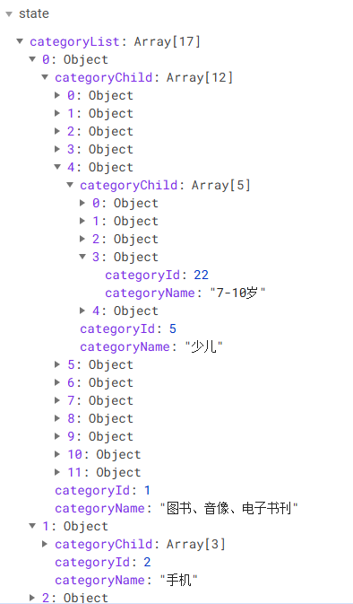
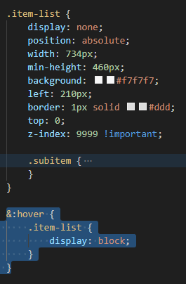
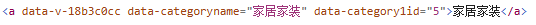

## TypeNav组件

### 三级联动展示数据

当组件挂载完毕，就可以开始向服务器发请求，获取数据。

```vue
<script>
// 用辅助函数，从仓库中获取数据
import { mapState } from 'vuex';

export default {
    name: 'TypeNav',
    // 组件挂载完毕，可以向服务器发请求
    mounted() {
        // 通知vuex发请求，获取数据，存储于仓库之中
        this.$store.dispatch('categoryList')
    },
}
</script>
```

此时action并不认识`categoryList`，于是进入home仓库，`store/home/inex.js`，在action中书写`categoryList`。

```js
// home模块小仓库
const state = {};
const actions = {
    // 通过api里面的接口函数调用，向服务器发请求，获取服务器的数组
    categoryList{} {
        
    }
};
const mutations = {};
const getters = {};

export default { state, actions, mutations, getters };
```

要发送请求，就要把当时写好的api（[src/api/index.js](#####>3. API接口统一管理)）引入进来。

```js
// home模块的小仓库
import {reqCategoryList} from '@/api'

const state = {};
const actions = {
    // 通过api里面的接口函数调用，向服务器发请求，获取服务器的数组
    categoryList{} {
        
    }
};
const mutations = {};
const getters = {};

export default { state, actions, mutations, getters };
```

这时就要回home仓库调用`reqCategoryList()`函数了。

```js
// home模块的小仓库
import {reqCategoryList} from '@/api'

const state = {
    // state中的数据默认初始值别瞎写，服务器返回的是对象，初始值就是对象，服务器返回的是数组，初始值就是数组
    // 根据接口的返回值进行初始化
    categoryList: []
};
const actions = {
    // 通过api里面的接口调用，向服务器发请求，获取服务器的数组
    async categoryList({commit}){
        let result =  await reqCategoryList();
        console.log('result: ', result);
        if(result.code === 200){
            commit('CATEGORYLIST', result.data)
        }
    }
};
const mutations = {
    CATEGORYLIST(state, data){
        state.categoryList = data
    }
};
const getters = {};

export default { state, actions, mutations, getters };
```

这时，打开vuex，即可看到home组件的state中已经存在数据，如下图所示：



这时候，再回到`TypeNav`组件，借助`mapState`辅助函数，从仓库中获取数据。完整script代码如下所示：

```js
// 用辅助函数，从仓库中获取数据
import { mapState } from 'vuex';

export default {
    name: 'TypeNav',
    computed: {
        // 辅助函数，从仓库中获取数据（数组写法）
        // ...mapState(['categoryList'])

        // 对象写法
        ...mapState({
            // 右侧需要的是一个函数，当使用这个计算属性时，右侧函数会立即执行一次
            // 注入一个参数state，其实是大仓库中的数据
            // categoryList:(state)=>{
            //     return state.home.categoryList
            // }
            categoryList:state=>state.home.categoryList //简写形式
        })
    },
    // 组件挂载完毕，可以向服务器发请求
    mounted() {
        // 通知vuex发请求，获取数据，存储与仓库之中
        this.$store.dispatch('categoryList')
    },
}
```

根据state中获取到的数据，在`<template>`中展示数据：

```vue
<template>
    <div>
        <!-- 商品分类导航 -->
       	 ...
        <div class="item" v-for="(c1, index) in categoryList" :key="c1.categoryId">
           <h3>
             <a href="">{{ c1.categoryName }}</a>
           </h3>
           <div class="item-list clearfix">
               <div class="subitem" v-for="(c2, index) in c1.categoryChild" :key="c2.categoryId">
                  <dl class="fore">
                     <dt>
                        <a href="">{{ c2.categoryName }}</a>
                     </dt>
                     <dd>
                        <em v-for="(c3, index) in c2.categoryChild" :key="c3.categoryId">
                           <a href="">{{ c3.categoryName }}</a>
                        </em>
                     </dd>
                   </dl>
               </div>
            </div>   
        </div>
        		 ...
    </div>
</template>
```

### 三级联动动态背景

#### 一级分类动态添加背景颜色：

1. 采用样式完成：可行，但不推荐

2. 通过 JS 完成：

   ```vue
   <template>
       <div>
           <!-- :class="{cur:currentIndex === index}" 如果当前鼠标移动到哪个一级分类，就给哪个分类添加一个cur样式 -->
           <div class="item" v-for="(c1, index) in categoryList" :key="c1.categoryId" 
                :class="{cur:currentIndex === index}">
                <h3 @mouseenter="changeIndex(index)" @mouseleave="changeIndex(-1)">
                    <a href="">{{ c1.categoryName }}</a>
                </h3>
            </div>   
       </div>
   </template>
   
   <script>
   // 用辅助函数，从仓库中获取数据
   import { mapState } from 'vuex';
   
   export default {
       name: 'TypeNav',
       data() {
           return {
           // 存储用户鼠标移动到哪个一级分类
           currentIndex: -1,
           
           }
       },
       computed: {
           ...mapState({
               categoryList:state=>state.home.categoryList //简写形式
           })
       },
       methods: {
           /**
            * 鼠标进入修改响应式数据currentIndex属性
            * @param index 鼠标移动到哪个一级分类元素的索引值
            */
           changeIndex(index){
               this.currentIndex = index;
           }
       },
       // 组件挂载完毕，可以向服务器发请求
       mounted() {
           // 通知vuex发请求，获取数据，存储与仓库之中
           this.$store.dispatch('categoryList')
       },
   }
   </script>
   
   <style lang="less" scoped>
   .type-nav {
           border-bottom: 2px solid #e1251b;
   
           .container {
               ......
               }
   
               .sort {
                   ......
   
                   .all-sort-list2 {
                       .item {
                           ......
                       }
                       .cur {
                           background-color: skyblue;
                       }
                   }
               }
           }
       }
   </style>
   ```

   > ##### Tips
   >
   > @mouseenter：鼠标进入事件
   >
   > @mouseleave：鼠标移出事件
   >
   > `:class="{cur:currentIndex === index}"`表示，如果当前鼠标移动到哪个一级分类，就给哪个分类添加一个cur样式（见<style>部分）。
   >
   > 当鼠标移入到某个一级分类时，会调用`changeIndex()`方法，并将此时一级分类的`index`索引值传入该方法，导致`currentIndex`发生变化。此时`currentIndex`的值和一级分类索引值`index`相同，于是会给当前一级分类添加一个cur样式，即添加背景色。

注意：按照上述代码，将鼠标移出`h3`标签时，将不会再显示二级、三级分类，所以将要将鼠标移出事件委派到更大的`div`中，即如下代码：

```vue
<div @mouseleave="changeIndex(-1)">
    <h2 class="all">全部商品分类</h2>
    <div class="sort">
        <div class="all-sort-list2" @click="goSearch">
            <div class="item" v-for="(c1, index) in categoryList" :key="c1.categoryId" 
                 :class="{cur:currentIndex === index}">
                <h3 @mouseenter="changeIndex(index)" >
                    <a>{{ c1.categoryName }}</a>
                </h3>
                <div class="item-list clearfix" 
                     :style="{display: currentIndex === index ? 'block' : 'none'}">
                    <div class="subitem" v-for="(c2, index) in c1.categoryChild" :key="c2.categoryId">
                        <dl class="fore">
                            <dt>
                                <a>{{ c2.categoryName }}</a>
                            </dt>
                            <dd>
                                <em v-for="(c3, index) in c2.categoryChild" :key="c3.categoryId">
                                    <a>{{ c3.categoryName }}</a>
                                </em>
                            </dd>
                        </dl>
                    </div>
                </div>
            </div>

        </div>
    </div>
</div>
```


#### JS控制二级三级商品分类的显示与隐藏

最开始的时候，是通过CSS样式 `display: block | none` 来显示或隐藏二三级商品分类的。此时将CSS样式中的鼠标移入事件删掉。



此时，鼠标移动到一级标题上，二级三级商品分类并不会显示了。在二级三级分类标签上，添加动态样式，当 `currentIndex` === `index`时，`display`属性改为`block`，否则为`none`。

```html
<div class="item-list clearfix" :style="{display: currentIndex === index ? 'block' : 'none'}">
    <div class="subitem" v-for="(c2, index) in c1.categoryChild" :key="c2.categoryId">
        <dl class="fore">
            <dt>
                <a href="">{{ c2.categoryName }}</a>
            </dt>
            <dd>
                <em v-for="(c3, index) in c2.categoryChild" :key="c3.categoryId">
                    <a href="">{{ c3.categoryName }}</a>
                </em>
            </dd>
        </dl>
    </div>
</div>
```

`:style="{display: currentIndex === index ? 'block' : 'none'}"` 如果当前鼠标移动到哪个一级分类，就给哪个一级分类的display属性添加一个block。


### 三级联动节流操作

正常情况，用户慢慢的操作，每次事件的触发，回调函数都会执行。

当鼠标快速从三级联动的顶部滑到底部时，本该每个三级联动选项都被触发，但是因为每触发一次，回调函数都要去执行一次，所以会出现卡顿现象。

`节流`：在规定的时间间隔内不会重复触发回调，只有大于这个时间间隔才会触发回调，把频繁触发改为少量触发。

```js
import _ from 'lodash'; // 这种引入方式是把lodash的全部功能函数引入

methods: {
        /**
         * 防抖函数
         	* 鼠标进入修改响应式数据currentIndex属性
         * @param index 鼠标移动到哪个一级分类元素的索引值
         */
        changeIndex:_.throttle(function(index){
            this.currentIndex = index;
        }, 500)
    },
```

```js
import {throttle} from 'lodash'; // 按需引入，引入节流函数

methods: {
        /**
         * 防抖函数
         * 鼠标进入修改响应式数据currentIndex属性
         * @param index 鼠标移动到哪个一级分类元素的索引值
         */
        changeIndex:throttle(function(index){
            this.currentIndex = index;
        }, 50)
    },
```


### 三级联动的路由跳转与传递参数

三级联动用户是可以点击的：一级分类、二级分类、三级分类

当点击的时候，会跳转到Search模块，一级会把用户选中的产品在路由跳转的时候进行传递

> #### 路由跳转
>
> 1. 声明式导航：router-link
> 2. 编程式导航: push | replace

#### 声明式导航

三级联动如果使用声明式导航router-link，可以实现路由的跳转与参数传递。

router-link：是一个组件，当服务器的数据返回之后，会循环出很多个router-link组件【创建很多组件实例】，创建组件实例的时候，一瞬间创建了很多实例，很耗费内存，因此会出现**卡顿现象**。

因此不使用声明式导航router-link进行路由跳转。

```html
<div class="sort">
    <div class="all-sort-list2">
        <div class="item" v-for="(c1, index) in categoryList" :key="c1.categoryId" 
             :class="{cur:currentIndex === index}">
            <h3 @mouseenter="changeIndex(index)" @mouseleave="changeIndex(-1)">
                <!-- <a href="">{{ c1.categoryName }}</a> -->
                <router-link to="/search">{{ c1.categoryName }}</router-link>
            </h3>
            <div class="item-list clearfix" 
                 :style="{display: currentIndex === index ? 'block' : 'none'}">
                <div class="subitem" v-for="(c2, index) in c1.categoryChild" :key="c2.categoryId">
                    <dl class="fore">
                        <dt>
                            <!-- <a href="">{{ c2.categoryName }}</a> -->
                            <router-link to="/search">{{ c2.categoryName }}</router-link>
                        </dt>
                        <dd>
                            <em v-for="(c3, index) in c2.categoryChild" :key="c3.categoryId">
                                <!-- <a href="">{{ c3.categoryName }}</a> -->
                                <router-link to="/search">{{ c3.categoryName }}</router-link>
                            </em>
                        </dd>
                    </dl>
                </div>
            </div>
        </div>
    </div>
</div>
```

#### 编程式导航

```html
<div class="sort">
    <div class="all-sort-list2" @click="goSearch">
        <div class="item" v-for="(c1, index) in categoryList" :key="c1.categoryId" 
             :class="{cur:currentIndex === index}">
            <h3 @mouseenter="changeIndex(index)" >
                <!-- 给a标签添加自定义属性 data-categoryName, data-category1Id -->
                <a :data-categoryName="c1.categoryName" :data-category1Id="c1.categoryId">
                    {{ c1.categoryName }}
                </a>
            </h3>
            <div class="item-list clearfix" 
                 :style="{display: currentIndex === index ? 'block' : 'none'}">
                <div class="subitem" v-for="(c2, index) in c1.categoryChild" :key="c2.categoryId">
                    <dl class="fore">
                        <dt>
                            <a :data-categoryName="c2.categoryName" :data-category2Id="c2.categoryId">
                                {{ c2.categoryName }}
                            </a>
                        </dt>
                        <dd>
                            <em v-for="(c3, index) in c2.categoryChild" :key="c3.categoryId">
                                <a :data-categoryName="c3.categoryName" 
                                   :data-category3Id="c3.categoryId">
                                    {{ c3.categoryName }}
                                </a>
                            </em>
                        </dd>
                    </dl>
                </div>
            </div>
        </div>
    </div>
</div>
```

给a标签添加自定义属性 `data-categoryName`, `data-category1Id`后，经过浏览器处理，会由驼峰式变成如下图所示的全小写。



想要使用这些自定义属性，需要在js代码中进行接收。代码如下所示：

```js
methods: {
    goSearch(event){
        // 编程式导航 + 事件委派
        // 利用事件委派，会遇到的问题：1. 如何知道点击的一定是a标签；2. 如何获取参数（1、2、3级分类的name、id）
        // 针对第一个问题，给a标签加上自定义属性 data-category-name，然后通过自定义属性获取；

        let element = event.target; // 获取当前点击的元素，需要找到带有data-category-name属性的节点
        console.log(element);
        // 节点有一个属性 dataset，可以获取节点的自定义属性和属性值
        let {categoryname, category1id, category2id, category3id} = element.dataset; // 如果标签身上拥有 categoryname 属性，那么一定是 a 标签

        if (categoryname) {
            // 整理路由跳转的参数
            let location = {name: 'search'};
            let query = {categoryName: categoryname}
            if (category1id) {
                query.category1Id = category1id
            }else if (category2id) {
                query.category2Id = category2id
            }else if (category3id) {
                query.category3Id = category3id
            }

            // 整理完参数
            // console.log(location, query)
            location.query = query

            // 路由跳转
            this.$router.push(location)
        }

    }
},
```

