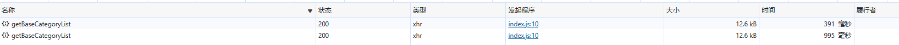
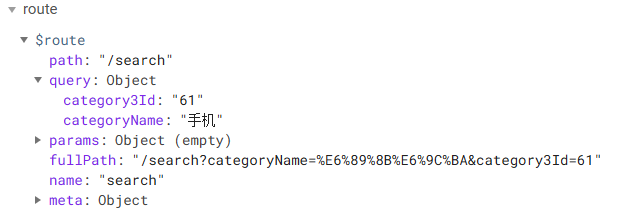
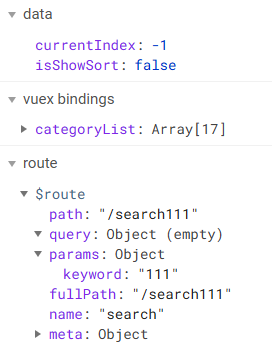

## 05-Search组件中的TypeNav

TypeNav组件已经注册为全局组件，所以不再需要重新引入，直接使用即可

```vue
<template>
    <div>
        <TypeNav></TypeNav>
    </div>
</template>

<script>
export default {
    name: 'SearchIndex'
}
</script>

<style>

</style>
```

### 商品分类列表显示与隐藏

要求在05-Search组件中，商品分类列表默认是关闭的，鼠标移动到“全部商品分类”才显示，所以需要进入 TypeNav 组件中进行设置。

在分类列表中绑定 v-show，当组件挂载完毕，如果不是Home组件，就让 v-show 属性变为 false。

```vue
<template>
    <div>
        <div @mouseleave="leaveIndex">
            <h2 class="all">全部商品分类</h2>
            <div class="sort" v-show="isShowSort">
                ...
            </div>
        </div>
    </div>
</template>

<script>
    export default {
        name: 'TypeNav',
        data() {
            return {
                // 存储用户鼠标移动到哪个一级分类
                currentIndex: -1,
                isShowSort: true, // 控制商品分类的显示与隐藏
            }
         },
        // 组件挂载完毕，可以向服务器发请求
        mounted() {
           // 通知vuex发请求，获取数据，存储与仓库之中
           this.$store.dispatch('categoryList');

           // 当组件挂载完毕，如果不是Home组件，就让 isShowSort 属性变为 false
            if (this.$route.path !== '/home'){
                this.isShowSort = false;
            }
        },
    }
</script>
```

关于鼠标移动和移出“全部商品分类”显示和隐藏商品分类列表，则需要加入鼠标移入移出事件。

```vue
<template>
    <div>
        <div @mouseleave="leaveShowSort" @mouseenter="enterShowSort">
            <h2 class="all">全部商品分类</h2>
            <div class="sort" v-show="isShowSort">
                ...
            </div>
        </div>
    </div>
</template>

<script>
    export default {
        name: 'TypeNav',
        data() {
            return {
                // 存储用户鼠标移动到哪个一级分类
                currentIndex: -1,
                isShowSort: true, // 控制商品分类的显示与隐藏
            }
         },
        // 组件挂载完毕，可以向服务器发请求
        mounted() {
           // 通知vuex发请求，获取数据，存储与仓库之中
           this.$store.dispatch('categoryList');

           // 当组件挂载完毕，如果不是Home组件，就让 isShowSort 属性变为 false
            if (this.$route.path !== '/home'){
                this.isShowSort = false;
            }
        },
        methods: {
            /**
             * 鼠标离开时，如果不在home页面，就隐藏商品分类
             */
           leaveShowSort(){
               this.currentIndex = -1;
               if (this.$route.path !== '/home') {
                   this.isShowSort = false;
                }
            },
           /**
            * 当鼠标移入时，显示商品分类列表
            */
           enterShowSort(){
               this.isShowSort = true
            }
    }
</script>
```

### 商品分类列表显示与隐藏的过渡动画

过渡动画的前提是 组件 或 元素 务必要有 `v-if` 或 `v-show` 指令才可以进行。

需要用transition将要添加过渡动画的 组件 或 元素 框起来

```html
<transition name="sort">
    <div>
        <div @mouseleave="leaveShowSort" @mouseenter="enterShowSort">
            <h2 class="all">全部商品分类</h2>
            <transition>
                <div class="sort" v-show="isShowSort">
                    ...
                </div>
            </transition>
        </div>
    </div>
</transition>
```

添加过渡动画样式。

```less
// 过渡动画的样式
// 过渡动画进入状态
.sort-enter {
    height: 0px;
}
// 过渡动画结束状态
.sort-enter-to {
    height: 461px;
}
.sort-enter-active {
    transition: all 0.5s linear; // 过渡时间, 过渡方式
}
```


## TypeNav组件优化

每次回到Home组件和05-Search组件，都会向服务器发送一个如下图所示的`getBaseCategoryList`的请求，只要用到TypeNav组件就会发送这样的请求。



App根组件是所有组件中最先执行的，且只执行一次，所以可以把TypeNav组件中的派发action部分放置在App组件中，使其只执行一次。这样每次需要使用categoryList数据前，这些数据已经存在仓库中了。

```vue
<template>
  <div id="app">
    <HeaderIndex></HeaderIndex>
      <!-- 路由组件的出口 -->
      <router-view></router-view>

    <!-- 在Home、Search显示Footer组件，在Login、Register是隐藏的 -->
    <FooterIndex v-show="$route.meta.isShowFooter"></FooterIndex>
  </div>
</template>

<script>
    import HeaderIndex from './components/Header';
    import FooterIndex from './components/Footer';

    export default {
      name: 'App',
      components: {
        HeaderIndex,
        FooterIndex,
      },
      mounted() {
        // 通知vuex发请求，获取数据，存储与仓库之中
        // 派发一个action，获取商品分类的三级列表数据
        this.$store.dispatch('categoryList');
      }
    }
</script>
```

`main.js`也是只执行一次，但是不能将其放到里边，因为`main.js`不是一个组件实例，组件实例才有`$store。


## 合并params和query参数

目前从商品分类列表中进入05-Search组件，传参只有query参数，没有params参数



如果从Header组件中搜索，进入05-Search组件，传参只有params参数



即目前的情况，到达05-Search组件，传递的参数只能带query或params单独一个，不是组合的。所以需要合并参数。

所以在TypeNav组件中，路由跳转时要进行判断，如果带有params参数，也要顺便传递过去。

```js
goSearch(event){
    // 编程式导航 + 事件委派
    // 利用事件委派，会遇到的问题：1. 如何知道点击的一定是a标签；2. 如何获取参数（1、2、3级分类的name、id）
    // 针对第一个问题，给a标签加上自定义属性 data-category-name，然后通过自定义属性获取；

    let element = event.target; // 获取当前点击的元素，需要找到带有data-category-name属性的节点
    console.log(element);
    // 节点有一个属性 dataset，可以获取节点的自定义属性和属性值
    let {categoryname, category1id, category2id, category3id} = element.dataset; // 如果标签身上拥有 categoryname 属性，那么一定是 a 标签

    if (categoryname) {
        // 整理路由跳转的参数
        let location = {name: 'search'};
        let query = {categoryName: categoryname}
        if (category1id) {
            query.category1Id = category1id
        }else if (category2id) {
            query.category2Id = category2id
        }else if (category3id) {
            query.category3Id = category3id
        }

        // 整理完参数
        // 路由跳转时，如果带有params参数，顺便传递过去
        if(this.$route.params) {
            location.params = this.$route.params
            location.query = query
        }

        // 路由跳转
        this.$router.push(location)
    }
},
```

同理，在Header组件中也要判断一下是否有query参数

```js
goSearch(){
    if (this.$route.query) {
        let location = {name: 'search', params: { keyword: this.keyword || undefined }};
        location.query = this.$route.query;
        this.$router.push(location);
    }
}
```

这时，在搜索“111”之后，再从商品分类列表进入新的05-Search组件，会发现params和query参数都有东西了。


