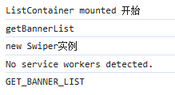

## Mock配置

服务器返回的数据（接口），只有商品分类菜单的数据，对于ListContainer和Floor组件的数据，服务器是没有提供的，所以需要我们自己模拟（mock）数据。如果想要模拟数据，需要一个插件 `mockjs`（生成随机数据，拦截Ajax请求）

```bash
npm install mockjs
```

> ## 使用步骤
>
> 1. 在项目的src中创建一个mock文件夹，
> 2. 准备json数据（mock文件夹中创建相应的json文件）
> 3. 把mock数据需要的图片放置在public文件夹中（public文件夹在打包的时候，会原封不动打包到dist文件夹中）
> 4. 创建`mockServe.js`，通过mockjs插件实现模拟数据
> 5. `mockServe.js`文件在入口文件中引入，至少需要执行一次，才能模拟数据

### banners.json

```json
// banners.json
[
    {
        "id": "1",
        "imgUrl": "/images/banner1.jpg"
    },
    {
        "id": "2",
        "imgUrl": "/images/banner2.jpg"
    },
    {
        "id": "3",
        "imgUrl": "/images/banner3.jpg"
    },
    {
        "id": "4",
        "imgUrl": "/images/banner4.jpg"
    }
]
```

### floors.json

```json
// floors.json
[
    {
        "id": "001",
        "name": "家用电器",
        "keywords": ["节能补贴", "4K电视", "空气净化器", "IH电饭煲", "滚筒洗衣机", "电热水器"],
        "imgUrl": "/images/floor-1-1.png",
        "navList": [
            {
                "url": "#",
                "text": "热门"
            },
            {
                "url": "#",
                "text": "大家电"
            },
            {
                "url": "#",
                "text": "生活电器"
            },
            {
                "url": "#",
                "text": "厨房电器"
            },
            {
                "url": "#",
                "text": "应季电器"
            },
            {
                "url": "#",
                "text": "空气/净水"
            }
        ],
        "carouselList": [
            {
                "id": "0011",
                "imgUrl": "/images/floor-1-b01.png"
            },
            {
                "id": "0012",
                "imgUrl": "/images/floor-1-b02.png"
            },
            {
                "id": "0013",
                "imgUrl": "/images/floor-1-b03.png"
            }
        ],
        "recommendList": [
            "/images/floor-1-2.png",
            "/images/floor-1-3.png",
            "/images/floor-1-5.png",
            "/images/floor-1-6.png"
        ],
        "bigImg": "/images/floor-1-4.png"
    },
    {
        "id": "002",
        "name": "手机通讯",
        "keywords": ["节能补贴", "4K电视", "空气净化器", "IH电饭煲", "滚筒洗衣机", "电热水器"],
        "imgUrl": "/images/floor-1-1.png",
        "navList": [
            {
                "url": "#",
                "text": "热门"
            },
            {
                "url": "#",
                "text": "大家电"
            },
            {
                "url": "#",
                "text": "生活电器"
            },
            {
                "url": "#",
                "text": "厨房电器"
            },
            {
                "url": "#",
                "text": "应季电器"
            },
            {
                "url": "#",
                "text": "空气/净水"
            }
        ],
        "carouselList": [
            {
                "id": "0011",
                "imgUrl": "/images/floor-1-b01.png"
            },
            {
                "id": "0012",
                "imgUrl": "/images/floor-1-b02.png"
            },
            {
                "id": "0013",
                "imgUrl": "/images/floor-1-b03.png"
            }
        ],
        "recommendList": [
            "/images/floor-1-2.png",
            "/images/floor-1-3.png",
            "/images/floor-1-5.png",
            "/images/floor-1-6.png"
        ],
        "bigImg": "/images/floor-1-4.png"
    }
]
```

### mockServe.js

```js
// mockServe.js

// 引入mockjs模块
import Mock from 'mockjs';

// 把json数据格式引入【JSON数据没有对外暴露，但是可以引入】
// webpack 默认对外暴露的文件类型：图片、JSON数据格式、
import banner from './banners.json';
import floor from './floors.json';

// mock数据：第一个参数是模拟数据地址，第二个参数是模拟数据
Mock.mock('/mock/banners', {code: 200, data: banner}); // 模拟首页轮播数据
Mock.mock('/mock/floors', {code: 200, data: floor}); // 模拟首页楼层数据
```

### main.js

```js
// main.js

import Vue from 'vue'
import App from './App.vue'

...

// 引入mockServe.js
import '@/mock/mockServe'

new Vue({
  render: h => h(App),

  // 注册路由
  router,

  // 注册仓库，组件实例对象中，$store属性，可以获取仓库
  store
  
}).$mount('#app')
```


## 获取Banner轮播图数据

设置`mockRequest.js`，要注意将`baseURL`设置为`/mock`，其余部分和`request.js`相同。

```js
// 对于axios进行二次封装
import axios from "axios";

// 引入进度条 start: 进度条开始  done：进度条停止
import nProgress from "nprogress";
// 引入进度条样式
import "nprogress/nprogress.css";

// 利用axios对象的方法create，去创建一个axios实例
// requests就是axios，只不过稍微配置一下
const requests = axios.create({
  // 配置对象
  // 基础路径，发请求的时候，路径当中会出现api
  baseURL: "/mock",
  // 请求超时时间
  timeout: 5000,
});

// 请求拦截器：在发请求前，请求拦截器可以检测到，可以在请求发出去之前做一些事情
requests.interceptors.request.use(
  (config) => {
    // config 配置对象，里面有一个属性很重要，headers请求头
    nProgress.start(); // 开始进度条
    return config;
  },
  (err) => {
    // 请求失败
    return err;
  }
);

// 响应拦截器
requests.interceptors.response.use(
  (res) => {
    // 成功的回调函数，服务器响应数据回来以后，响应拦截器可以检测到，可以做一些事情
    nProgress.done(); // 结束进度条
    return res.data;
  },
  (err) => {
    // 失败的回调函数
    return Promise.reject(new Error("fail"));
  } 
);

export default requests;// 对于axios进行二次封装
import axios from "axios";

// 引入进度条 start: 进度条开始  done：进度条停止
import nProgress from "nprogress";
// 引入进度条样式
import "nprogress/nprogress.css";

// 利用axios对象的方法create，去创建一个axios实例
// requests就是axios，只不过稍微配置一下
const requests = axios.create({
  // 配置对象
  // 基础路径，发请求的时候，路径当中会出现api
  baseURL: "/mock",
  // 请求超时时间
  timeout: 5000,
});

// 请求拦截器：在发请求前，请求拦截器可以检测到，可以在请求发出去之前做一些事情
requests.interceptors.request.use(
  (config) => {
    // config 配置对象，里面有一个属性很重要，headers请求头
    nProgress.start(); // 开始进度条
    return config;
  },
  (err) => {
    // 请求失败
    return err;
  }
);

// 响应拦截器
requests.interceptors.response.use(
  (res) => {
    // 成功的回调函数，服务器响应数据回来以后，响应拦截器可以检测到，可以做一些事情
    nProgress.done(); // 结束进度条
    return res.data;
  },
  (err) => {
    // 失败的回调函数
    return Promise.reject(new Error("fail"));
  } 
);

export default requests;
```

设置首页轮播图接口（api/index.js）

```js
// 当前这个模块，是对所有的api进行统一管理

import requests from './request'
import mockRequests from './mockRequest'

// 三级联动的接口
// 请求地址：/api/product/getBaseCategoryList
// 请求方式：GET
// 参数：无参数
// axios发请求返回结果Promise对象
export const reqCategoryList = () => requests.get('/product/getBaseCategoryList')

// 获取banner（首页轮播图接口）
export const reqGetBannerList = () => mockRequests.get('/banners') // 要注意路径写对
```

home组件的仓库中，引入首页轮播图接口

```js
import {reqCategoryList, reqGetBannerList} from '@/api'
```

ListContainer组件派发action，将数据存储在仓库里

```vue
<script>

export default {
    name: 'ListContainer',
    mounted() {
        // 派发action，通过vuex发起ajax请求，将数据存储在仓库里
        this.$store.dispatch('getBannerList')
    }
}
</script>
```

回到home组件的仓库，配置action和mutation

```js
const state = {
    bannerList: [],
};
const actions = {
    // 获取首页轮播图的数据
    async getBannerList ({commit}) {
        let result = await reqGetBannerList();
        console.log('resultBannerList: ', result);
        if (result.code == 200) {
            commit('GET_BANNER_LIST', result.data)
        }
    }
};
const mutations = {
    /**
     * 
     * @param {*} state 状态对象，用于存储轮播图列表
     * @param {*} data 要更新的轮播图数据数组
     */
    GET_BANNER_LIST(state, data){
        state.bannerList = data
    }
};
```

此时，回到ListContainer组件，即可借助mapState将存储在仓库中的数据取出

```vue
<script>
    import { mapState } from 'vuex'

    export default {
        name: 'ListContainer',
        computed: {
            ...mapState({
                bannerList: state => state.home.bannerList
            })
        },
        mounted() {
            // 派发action，通过vuex发起ajax请求，将数据存储在仓库里
            this.$store.dispatch('getBannerList')
        }
    }
</script>
```


## Banner轮播图实现（Swiper）

### 通过计时器实现

安装Swiper

```bash
npm install --save swiper@5
```

> # 使用Swiper的步骤
>
> 1. 引包（JS、CSS）
> 2. 页面结构务必要有
> 3. new Swiper 实例（轮播图添加动态效果）

1. 引包

   ```js
   import Swiper from 'swiper'
   ```

   由于其他组件也会用到`swiper`样式，所以直接在入口文件（main.js）进行引入

   ```js
   // 引入swiper样式
   import "swiper/css/swiper.css"
   ```

2. 页面结构

   有多个轮播图，所以需要`v-for`遍历一下，直接用接收到的`bannerList`即可

   ```html
   <!--banner轮播-->
   <div class="swiper-container" id="mySwiper">
       <div class="swiper-wrapper">
           <div class="swiper-slide" v-for="(carousel, index) in bannerList" :key="carousel.id">
               
           </div>
       </div>
       <!-- 如果需要分页器 -->
       <div class="swiper-pagination"></div>
   
       <!-- 如果需要导航按钮 -->
       <div class="swiper-button-prev"></div>
       <div class="swiper-button-next"></div>
   </div>
   ```

3. new Swiper实例

   在`mounted`中创建Swiper实例

   因为mounted是在组件加载完毕之后执行，new Swiper实例需要在有页面结构之后

   ```js
   mounted() {
       // 派发action，通过vuex发起ajax请求，将数据存储在仓库里
       this.$store.dispatch('getBannerList')
   
       var mySwiper = new Swiper ('.swiper-container', {
           direction: 'vertical', // 垂直切换选项
           loop: true, // 循环模式选项
   
           // 如果需要分页器
           pagination: {
               el: '.swiper-pagination',
           },
   
           // 如果需要前进后退按钮
           navigation: {
               nextEl: '.swiper-button-next',
               prevEl: '.swiper-button-prev',
           },
   
           // 如果需要滚动条
           scrollbar: {
               el: '.swiper-scrollbar',
           },
       })     
       }
   ```

   但是，这时回到页面会发现，轮播图还是静态的，因为此时（mounted）的页面结构还不完整。

   分别在mounted、actions、mutations中打印如下信息，结果如下图所示

   ```js
   // ListContainer组件
   mounted() {
       console.log('ListContainer mounted 开始')
   
       // 派发action，通过vuex发起ajax请求，将数据存储在仓库里
       this.$store.dispatch('getBannerList')
   
       console.log('new Swiper实例')
   
       var mySwiper = new Swiper ('.swiper-container', {
           ...
       	 })     
     }
   
    // home仓库
   const actions = {
       async getBannerList ({commit}) {
           console.log('getBannerList')
           ...
       }
   };
   // home仓库
   const mutations = {
       GET_BANNER_LIST(state, data){
           console.log('GET_BANNER_LIST');
           ...
       }
   };
   ```

   

   会发现，由于结构代码中，有`v-for`，所以在数据还没有完全从服务器中获取到时，已经要new Swiper实例了，但此时因为没有获取完所有数据，结构还不完整，所以new Swiper实例失败，此时回到页面才会发现轮播图是静态的。

   专业来讲，`dispatch`中涉及到了异步语句，导致`v-for`遍历的时候结构还没有完全，所以 new Swiper 实例失败。

4. 将 new Swiper 放在 `update()` 中，可以实现轮播图效果，但是有一个问题，将来每更新一次数据，都会 new 一个 Swiper，会造成资源的浪费

   ```js
   updated() {
       var mySwiper = new Swiper ('.swiper-container', {
           loop: true, // 循环模式选项
   
           // 如果需要分页器
           pagination: {
               el: '.swiper-pagination',
           },
   
           // 如果需要前进后退按钮
           navigation: {
               nextEl: '.swiper-button-next',
               prevEl: '.swiper-button-prev',
           },
       })  
     }
   ```

5. 在`mounted`中设置一个定时器，将 new Swiper实例放入其中，可以实现。

   但是会有bug，要在打开页面之后等待几秒，才能够滑动轮播图，等待的时间会受到设备、网络等因素干扰，不确定性较大，不建议使用。

   ```js
   mounted() {
       console.log('ListContainer mounted')
       // 派发action，通过vuex发起ajax请求，将数据存储在仓库里
       this.$store.dispatch('getBannerList')
   
       setTimeout(() => {
           var mySwiper = new Swiper ('.swiper-container', {
               loop: true, // 循环模式选项
   
               // 如果需要分页器
               pagination: {
                   el: '.swiper-pagination',
                   clickable : true, // 点击分页器可以切换到相应的slide
               },
   
               // 如果需要前进后退按钮
               navigation: {
                   nextEl: '.swiper-button-next',
                   prevEl: '.swiper-button-prev',
               },
           }) 
           }, 2000);
   },
   ```

### 通过watch+nextTick实现

#### watch监听

watch：数据监听，监听已有数据的变化（对象写法、函数写法）

将 new Swiper 放置在watch中，会发现轮播图又变成静态的了。这时因为当前这个函数执行，只能保证bannerList数据已经有了，但是不能保证v-for已经执行完毕，只有 v-for执行完毕，才会有完整结构，现在在watch中是没办法保证的。

```js
watch: {
    // 监听bannerList数据的变化，因为这条数据发生过变化（空数组 -> 数组里有4个元素）
    bannerList: {
        /**
                 * 监听到数据变化，执行回调函数
                 * 如果执行handler，代表组件实例身上的这个属性的属性值已经有了【数组里有4个元素】
                 */
        handler(newValue, oldValue) {
            // 当前这个函数执行，只能保证bannerList数据已经有了，但是不能保证v-for已经执行完毕
            // v-for执行完毕，才会有完整结构，现在在watch中是没办法保证的
            var mySwiper = new Swiper ('.swiper-container', {
                loop: true, // 循环模式选项

                // 如果需要分页器
                pagination: {
                    el: '.swiper-pagination',
                    clickable : true, // 点击分页器可以切换到相应的slide
                },

                // 如果需要前进后退按钮
                navigation: {
                    nextEl: '.swiper-button-next',
                    prevEl: '.swiper-button-prev',
                },
            }) 
            }
    }
}
```

#### nextTick

`Vue.nextTick([callback, context])`：在下次DOM更新<u>**循环结束之后**</u>，执行延迟回调。在<u>**修改数据之后**</u>，立即使用这个方法，获取更新后的DOM

在这个例子中解释一下：bannerList初始的状态是一个空数组，第一次遍历的时候结构还没有。“<u>下次DOM更新</u>”表示bannerList由一个空数组变成带有4个元素的数组，并且`v-for`已经遍历完成，结构已经有了。“<u>循环结束之后</u>”表示`v-for`已经结束，结构已经有了。“<u>修改数据之后</u>”表示bannerList由空数组变为带有4个元素的数组之后，表示服务器的数据回来了。

简单来说，就是获取了最新的数据，并且渲染成功之后，再执行这个回调。

```js
watch: {
    // 监听bannerList数据的变化，因为这条数据发生过变化（空数组 -> 数组里有4个元素）
    bannerList: {
        /**
         * 监听到数据变化，执行回调函数
         * 如果执行handler，代表组件实例身上的这个属性的属性值已经有了【数组里有4个元素】
         */
        handler(newValue, oldValue) {
            // 当前这个函数执行，只能保证bannerList数据已经有了，但是不能保证v-for已经执行完毕
            // v-for执行完毕，才会有完整结构，现在在watch中是没办法保证的
            // 所以，在watch中，不能直接操作DOM，需要使用nextTick
            this.$nextTick(() => {
                // 当你执行这个回调的时候，保证服务器的数据回来了，v-for执行完毕了，DOM结构也生成完毕
                var mySwiper = new Swiper ('.swiper-container', {
                    loop: true, // 循环模式选项

                    // 如果需要分页器
                    pagination: {
                        el: '.swiper-pagination',
                        clickable : true, // 点击分页器可以切换到相应的slide
                    },

                    // 如果需要前进后退按钮
                    navigation: {
                        nextEl: '.swiper-button-next',
                        prevEl: '.swiper-button-prev',
                    },
                })
            })
        }
    }
}
```

`nextTick`可以保证页面中的结构一定是有的，经常和很多插件一起使用（都需要DOM存在）

