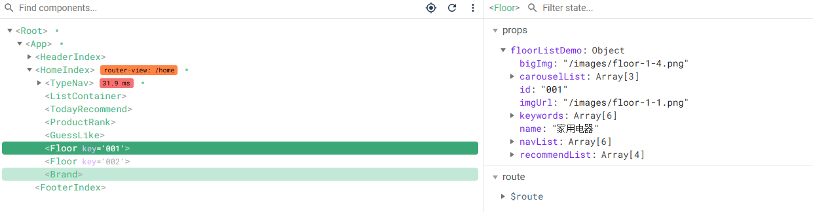

## 获取Floor组件的mock数据

### 配置仓库

设置Floor组件接口（api/index.js）

```js
// api/index,js

import mockRequests from './mockRequest'

// 获取floor数据
export const reqGetFloorList = () => mockRequests.get('/floors')
```

Floor模块在Home组件中，所以还是回到Home仓库（store/home/index.js）

```js
// home模块的小仓库
import {reqCategoryList, reqGetBannerList, reqGetFloorList} from '@/api'

const state = {
    // state中的数据默认初始值别瞎写，服务器返回的是对象，初始值就是对象，服务器返回的是数组，初始值就是数组
    // 根据接口的返回值进行初始化
    categoryList: [],
    bannerList: [],
    floorList: []
};
const actions = {
    ...
    // 获取首页floor的数据
    async getFloorList ({commit}) {
        let result = await reqGetFloorList();
        if (result.code == 200) {
            commit('GET_FLOOR_LIST', result.data)
        }
    }
};
const mutations = {
    ...
    /**
     * 
     * @param {*} state 状态对象，用于存储floor数据列表
     * @param {*} data 要更新的floor数据数组
     */
    GET_FLOOR_LIST(state, data){
        state.floorList = data
    }
};
const getters = {};

export default { state, actions, mutations, getters };
```

### 派发action

```vue
<template>
    <div>
        <!-- 三级联动全局组件，不需要再import引入 -->
        <TypeNav></TypeNav>

        <ListContainer></ListContainer>
        <TodayRecommend></TodayRecommend>
        <ProductRank></ProductRank>
        <GuessLike></GuessLike>
        
        <Floor></Floor>
        <Floor></Floor>
        
        <Brand></Brand>
    </div>
</template>
```

Home组件中有两个Floor组件，也就是说要v-for遍历两个Floor组件，所以派发action不能在Floor组件中，因为如果这样做的话，没办法v-for遍历出两个Floor组件。所以说`getFloorList`这个action要在Home组件中进行派发。

```js
import { mapState } from 'vuex';

export default {
    name: 'HomeIndex',
    computed: {
        ...mapState({
            floorList: state => state.home.floorList
       	 })
   	  },
    mounted() {
        // 派发action，获取Floor组件的数组
        this.$store.dispatch('getFloorList')
    }
}
```

`v-for`也可以在自定义标签中使用

```vue
<template>
    <div>
        <!-- 三级联动全局组件，不需要再import引入 -->
        <TypeNav></TypeNav>

        <ListContainer></ListContainer>
        <TodayRecommend></TodayRecommend>
        <ProductRank></ProductRank>
        <GuessLike></GuessLike> 
        <Floor v-for="(floor, index) in floorList" :key="floor.id"></Floor>

        <Brand></Brand>

    </div>
</template>
```

## 数据展示

### 将数据传递到Floor组件

现在数据在父组件这里，现在要把数据放到子组件Floor中，这里就用到了父子组件通信（props）

> # 组件通信
>
> - props：用于父子组件通信
> - 自定义事件：\$on 、\$emit，可以实现子给父通信
> - 全局事件总线：$bus 全能
> - pubsub-js：vue中几乎不用，全能
> - 插槽
> - vuex

```html
<Floor v-for="(floor, index) in floorList" :key="floor.id" :floorListDemo="floor"></Floor>
```

这时再回到子组件Floor中进行接收

```js
export default {
    name: 'Floor',
    props: ['floorListDemo']
}
```

这时，已经把`floorListDemo`传到子组件Floor中了，如下图所示结构



### 动态展示Floor组件

```vue
<template>
    <div>
        <!--楼层-->
        <div class="floor">
            <div class="py-container">
                <div class="title clearfix">
                    <h3 class="fl">{{floorListDemo.name}}</h3>
                    <div class="fr">
                        <ul class="nav-tabs clearfix">
                            <li class="active" v-for="(nav, index) in floorListDemo.navList" 
                                :key="index">
                                <a href="#tab1" data-toggle="tab">{{nav.text}}</a>
                            </li>
                        </ul>
                    </div>
                </div>
                <div class="tab-content">
                    <div class="tab-pane">
                        <div class="floor-1">
                            <div class="blockgary">
                                <ul class="jd-list">
                                    <li v-for="(kwds, index) in floorListDemo.keywords" :key="index">
                                        {{kwds}}
    		 	                                </li>
                                </ul>
                                
                            </div>
                            <div class="floorBanner">
                                <div class="swiper-container" ref="floor1Swiper">
                                    <div class="swiper-wrapper">
                                        <div class="swiper-slide" 
                                             v-for="(carousel, index) in floorListDemo.carouselList" 
                                             :key="carousel.id">
                                            
                                        </div>
                                        
                                    </div>
                                    <!-- 如果需要分页器 -->
                                    <div class="swiper-pagination"></div>

                                    <!-- 如果需要导航按钮 -->
                                    <div class="swiper-button-prev"></div>
                                    <div class="swiper-button-next"></div>
                                </div>
                            </div>
                            <div class="split">
                                <span class="floor-x-line"></span>
                                <div class="floor-conver-pit">
                                    
                                </div>
                                <div class="floor-conver-pit">
                                    
                                </div>
                            </div>
                            <div class="split center">
                                
                            </div>
                            <div class="split">
                                <span class="floor-x-line"></span>
                                <div class="floor-conver-pit">
                                    
                                </div>
                                <div class="floor-conver-pit">
                                    
                                </div>
                            </div>
                        </div>
                    </div>
                </div>
            </div>
        </div>
    </div>
</template>

<script>
import Swiper from 'swiper';

export default {
    name: 'Floor',
    props: ['floorListDemo'],
    mounted() {
        // 之前第一次写new Swiper时，在mounted中书写是不可以的。
        // 第一次写轮播图的时候，是在当前组件发请求、动态渲染结构，因此当时的写法在这里不行
        // Floor组件在自己内部是没有发请求的，数据是父组件给的
        // 即在这里的mounted，结构已经有了，所以可以直接在mounted中书写
        var mySwiper = new Swiper (
            this.$refs.floor1Swiper, // swiper的根元素 
            {
            loop: true, // 循环模式选项

            // 如果需要分页器
            pagination: {
                el: '.swiper-pagination',
                clickable : true, // 点击分页器可以切换到相应的slide
            },

            // 如果需要前进后退按钮
            navigation: {
                nextEl: '.swiper-button-next',
                prevEl: '.swiper-button-prev',
            },
        });
    }
}
</script>

<style lang="less" scoped>
    ...
</style>
```

## 封装共用组件Carsouel

### 封装准备

轮播图在ListContainer组件和Floor组件中都有用到相同结构，所以考虑将其拆分为共用组件

为了将其拆分为共用组件，所以希望这两部分的轮播图的代码格式最好相同，于是考虑将Floor组件中的new Swiper也写到watch中，结果发现，监听不到`floorListDemo`数据，因为数据是父组件给的，它的值从来没有发生变化，所以自然监听不到。

在watch中的第一行，加入`immediate: true`即可，代表立即监听。但是这样只能监听到数据有了，但是`v-for`动态渲染结构我们还没有办法确定，因此还是需要用到`nextTick`。

```js
watch: {
    floorListDemo: {
        // 立即监听，不管数据有没有发生变化，上来就监听一次
        immediate: true,
        handler(newValue, oldValue) {
            this.$nextTick(() => {
                var mySwiper = new Swiper (
                    this.$refs.floor1Swiper, // swiper的根元素 
                    {
                        loop: true, // 循环模式选项

                        // 如果需要分页器
                        pagination: {
                            el: '.swiper-pagination',
                            clickable : true, // 点击分页器可以切换到相应的slide
                        },

                        // 如果需要前进后退按钮
                        navigation: {
                            nextEl: '.swiper-button-next',
                            prevEl: '.swiper-button-prev',
                        },
                    }
                );
            })
        }
    	 }
}
```

---

### 封装Carsouel

components文件夹中创建Carsouel组件，将轮播图需要的组件复制进去，修改一下，如下所示：

```vue
<template>
    <div>
        <div class="swiper-container" ref="floor1Swiper">
            <div class="swiper-wrapper">
                <div class="swiper-slide" v-for="(carousel, index) in list" :key="carousel.id">
                    
                </div>
                
            </div>
            <!-- 如果需要分页器 -->
            <div class="swiper-pagination"></div>

            <!-- 如果需要导航按钮 -->
            <div class="swiper-button-prev"></div>
            <div class="swiper-button-next"></div>
        </div>
    </div>
</template>

<script>
    import Swiper from 'swiper';

    export default {
        name: 'CarouseIndex',
        props: ['list'],
        watch: {
            list: {
            // 立即监听，不管数据有没有发生变化，上来就监听一次
                immediate: true,
                handler(newValue, oldValue) {
                    this.$nextTick(() => {
                        var mySwiper = new Swiper (
                            this.$refs.floor1Swiper, // swiper的根元素 
                            {
                                loop: true, // 循环模式选项

                                // 如果需要分页器
                                pagination: {
                                    el: '.swiper-pagination',
                                    clickable : true, // 点击分页器可以切换到相应的slide
                                },

                                // 如果需要前进后退按钮
                                navigation: {
                                    nextEl: '.swiper-button-next',
                                    prevEl: '.swiper-button-prev',
                                },
                            }
                        );
                    })
                }
            }
        }

    }
</script>

<style>

</style>
```

在`main.js`中将该组件注册为全局组件

```js
// 轮播图组件（全局组件）
import CarouseIndex from '@/components/Carousel'
Vue.component(CarouseIndex.name, CarouseIndex)
```

将Floor组件和ListContainer组件中的轮播图部分删掉，将CarouseIndex插入对应位置，把list参数传进去

```html
<!-- ListContainer组件的banner部分 -->
<CarouseIndex :list="bannerList"></CarouseIndex>
```

```html
<!-- Floor组件的banner部分 -->
<CarouseIndex :list="floorListDemo.carouselList"></CarouseIndex>
```

