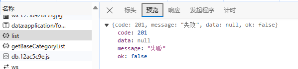
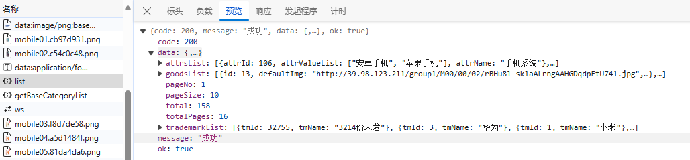
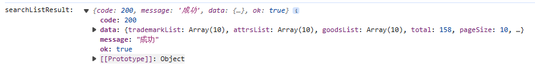
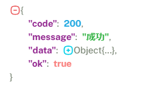
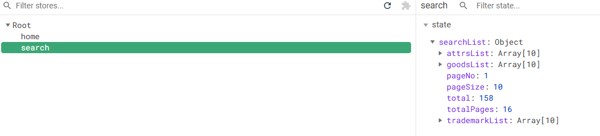
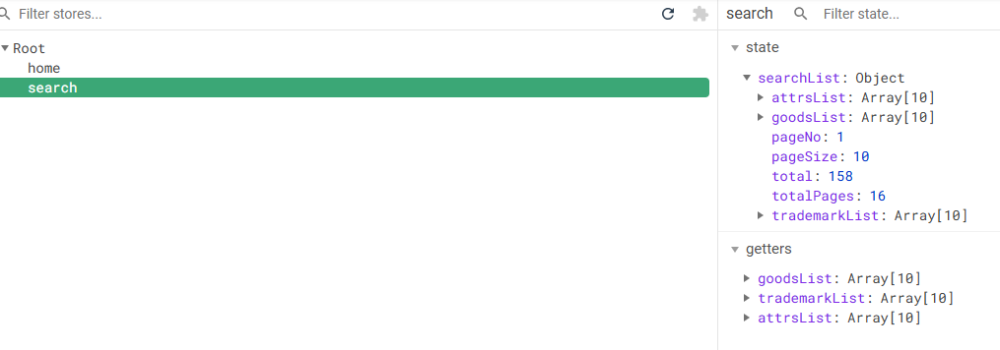

> # Search组件开发
>
> - [ ] 静态页面 + 静态组件拆分
> - [ ] 发请求（API）
> - [ ] vuex（三连环）
> - [ ] 组件获取仓库数据，动态展示数据

静态页面+组件拆分见 [Search路由组件_静态](..\static_pages_copy\静态组件\Search路由组件_静态) 


## Search模块vuex操作

- 请求地址：`/api/list`

- 请求方式：`POST`

- 参数格式：

  ```js
  {
    "category3Id": "61",
    "categoryName": "手机",
    "keyword": "小米",
    "order": "1:desc",
    "pageNo": 1,
    "pageSize": 10,
    "props": ["1:1700-2799:价格", "2:6.65-6.74英寸:屏幕尺寸"],
    "trademark": "4:小米"
  }
  ```

  这是我们第一个需要带参数的请求

### 获取搜索模块数据（api/index.js）

```js
// 当前这个模块，是对所有的api进行统一管理

import requests from './request'

// 获取搜索模块数据
// 当前这个接口，给服务器传递的参数params，至少是一个空对象（默认参数）
export const reqGetSearchInfo = (params) => requests({ url: '/list', method: 'post', data: params })
```

测试`reqGetSearchInfo`接口（main.js）—— 不传递参数

```js
import { reqGetSearchInfo } from './api'
console.log(reqGetSearchInfo())
```



测试`reqGetSearchInfo`接口（main.js）—— 传递空对象

```js
import { reqGetSearchInfo } from './api'
console.log(reqGetSearchInfo({}))
```



当前这个接口（获取搜索模块数据的接口），需要给服务器传递一个默认参数（至少是一个空对象）

### vuex三连环

回到Search仓库（store/search/index.js），引入`reqGetSearchInfo`接口，完善actions、mutations等部分

```js
// search模块的小仓库
import { reqGetSearchInfo } from '@/api';

const state = {
};
const actions = {
    // 获取search模块数据
    async getSearchList({commit}, params={}) {
        // reqGetSearchInfo()在获取服务器数据的时候，至少需要传递一个参数（空对象）
        // params形参：是当用户派发action的时候，第二个参数传递过来的，至少是一个空对象
        let result = await reqGetSearchInfo(params)
        console.log('searchListResult: ', result);
        if (result.code === 200) {
            commit('GET_SEARCH_LIST', result.data)
        }
    }
};
const mutations = {
    GET_SEARCH_LIST(state, data) {
        state.searchList = data
    }
};
const getters = {};

export default { state, mutations, actions, getters };
```

这个时候还不知道`searchList`的数据格式，所以需要派发测试一下，去Search组件测试

```vue
<script>
  import SearchSelector from './SearchSelector'
  export default {
    name: 'SearchIndex',
    components: {
      SearchSelector
    },
    mounted() {
      this.$store.dispatch('getSearchList', {})
    },
  }
</script>
```



将其解析一下，可知`data`是对象类型（Object）



所以回到Search仓库，将state中的`searchList`设置为一个空对象

```js
const state = {
    searchList: {}
};
```

这样就可以保证Search仓库中的数据已经有了




## Search模块动态展示产品列表

### getters简化仓库数据

按照之前的放，在Search模块中获取仓库数据

```js
computed: {
    ...mapState({
    	 	   goodsList: state => state.search.searchList.goodsList
    })
}
```

但是这样的话，后缀太长，容易出现错误。仓库中的`getters`在项目中是为了简化仓库中的数据

```js
// 这是模块的计算属性，简化数据
// 可以把将来在组件中需要用的数据简化一下,将来组件获取数据的时候就方便了
const getters = {
    /**
     * 商品列表
     * @param {*} state 当前仓库中的state,并非大仓库中的state
     */
    goodsList(state) {
        return state.searchList.goodsList || [];
    },
    trademarkList(state) {
        return state.searchList.trademarkList || [];
    },
    attrsList(state) {
        return state.searchList.attrsList || [];
    }
};
```

回到Search组件，通过`mapGetters`接收数据

```vue
<script>
  import SearchSelector from './SearchSelector'
  import {mapGetters} from 'vuex'

  export default {
    name: 'SearchIndex',
    components: {
      SearchSelector
    },
    computed: {
      ...mapGetters(['goodsList', 'trademarkList', 'attrsList'])
    },
    mounted() {
      this.$store.dispatch('getSearchList', {})
    },
  }
</script>
```

结果如下所示



### 展示商品列表数据

```html
<!-- 商品列表 -->
<div class="goods-list">
    <ul class="yui3-g">
        <li class="yui3-u-1-5" v-for="(good, index) in goodsList" :key="good.id">
            <div class="list-wrap">
                <div class="p-img">
                    <a href="item.html" target="_blank">
                        
                    </a>
                </div>
                <div class="price">
                    <strong>
                        <em>¥ </em>
                        <i>{{good.price}}.00</i>
                    </strong>
                </div>
                <div class="attr">
                    <a target="_blank" href="item.html" title="">{{ good.title }}</a>
                </div>
                <div class="commit">
                    <i class="command">已有<span>2000</span>人评价</i>
                </div>
                <div class="operate">
                    <a href="success-cart.html" target="_blank" 
                       class="sui-btn btn-bordered btn-danger">
                        加入购物车
                    </a>
                    <a href="javascript:void(0);" class="sui-btn btn-bordered">收藏</a>
                </div>
            </div>
        </li>

    </ul>
</div>
```

### 根据不同参数展示不同数据

当需要根据不同参数展示不同数据时，就会调动多次`action`，所以此时再把`dispatch`放在`mounted`部分就不合适了。可以将其封装在一个函数里。

```js
import SearchSelector from './SearchSelector'
import {mapGetters} from 'vuex'

export default {
    name: 'SearchIndex',
    components: {
      SearchSelector
    },
    data() {
      return {
        // 带给服务器的参数
        searchParams: {
          category1Id: "", // 一级分类id
          category2Id: "", // 二级分类id
          category3Id: "", // 三级分类id
          categoryName: "", // 分类名称
          keyword: "", // 搜索关键字
          order: "", // 排序字段
          pageNo: 1, // 当前页码
          pageSize: 20, // 每页显示记录数
          props: [], // 平台售卖属性
          trademark: "" // 品牌信息
        }
      }
    },
    computed: {
      ...mapGetters(['goodsList', 'trademarkList', 'attrsList'])
    },
    methods: {
      /**
       * 根据不同参数,获取搜索结果
       * @param params 搜索参数
       */
      getSearchListByParams() {
        this.$store.dispatch('getSearchList', this.searchParams)
      }
    },
    beforeMount() {
      // 复杂写法
      // this.searchParams.category1Id = this.$route.query.category1Id;
      // this.searchParams.category2Id = this.$route.query.category2Id;
      // this.searchParams.category3Id = this.$route.query.category3Id;
      // this.searchParams.categoryName = this.$route.query.categoryName;
      // this.searchParams.keyword = this.$route.query.keyword;
        
      // Object.assign: ES6子新增的语法，合并对象
      Object.assign(this.searchParams, this.$route.query, this.$route.params);
    },
    mounted() {
      this.getSearchListByParams();
    },
  }
```

`Object.assign`: ES6子新增的语法，合并对象。将`this.$route.query`和`this.$route.params`合并到`this.searchParams`对象中。

现在还有一个问题，search传参只能发送一次请求，想要再发送需要重新刷新页面，后期完善。


### SearchSelector模块数据展示

```vue
<template>
	 	 <div class="clearfix selector">
        <div class="type-wrap logo">
            <div class="fl key brand">品牌</div>
            <div class="value logos">
                <ul class="logo-list">
                    <li v-for="(trademark, index) in trademarkList" :key="trademark.tmId">
                        {{ trademark.tmName }}
    	 	 	               </li>
                </ul>
            </div>
            <div class="ext">
                <a href="javascript:void(0);" class="sui-btn">多选</a>
                <a href="javascript:void(0);">更多</a>
            </div>
        </div>
        <div class="type-wrap" v-for="(attr, index) in attrsList" :key="attr.attrId">
            <div class="fl key">{{attr.attrName}}</div>
            <div class="fl value">
                <ul class="type-list">
                    <li v-for="(attrValue, index) in attr.attrValueList" :key="index">
                        <a>{{attrValue}}</a>
                    </li>
    		             </ul>
        	     </div>
            <div class="fl ext"></div>
        </div>
    </div>
</template>

<script>
    import {mapGetters} from 'vuex';

    export default {
        name: 'SearchSelector',
        computed: {
            ...mapGetters(['trademarkList', 'attrsList'])
        }
    }
</script>
```


## 监听路由的变化再次发送请求获取数据

`watch`：数据监听，监听组件实例身上的属性的属性值的变化。监听路由的信息是否发生变化，如果发生变化，再次发送请求。

```vue
<script>
    import SearchSelector from './SearchSelector'
    import {mapGetters} from 'vuex'

    export default {
        name: 'SearchIndex',
        components: {
            SearchSelector
        	 },
        data() {
            return {
                // 带给服务器的参数
                searchParams: {
                    category1Id: "", // 一级分类id
                    category2Id: "", // 二级分类id
                    category3Id: "", // 三级分类id
                    categoryName: "", // 分类名称
                    keyword: "", // 搜索关键字
                    order: "", // 排序字段
                    pageNo: 1, // 当前页码
                    pageSize: 20, // 每页显示记录数
                    props: [], // 平台售卖属性
                    trademark: "" // 品牌信息
               	 }
           	 }
        	 },
        computed: {
            ...mapGetters(['goodsList', 'trademarkList', 'attrsList'])
        	 },
        methods: {
            /**
           * 根据不同参数,获取搜索结果
           * @param params 搜索参数
           */
            getSearchListByParams() {
                this.$store.dispatch('getSearchList', this.searchParams)
            	 }
       	 },
        // 在发送请求之前，把接口需要传递的参数，进行整理
        // 在给服务器发送请求前，把参数整理好，服务器就会返回查询的数据
        beforeMount() {
            // Object.assign: ES6子新增的语法，合并对象
            Object.assign(this.searchParams, this.$route.query, this.$route.params);
        	 },
        mounted() {
            this.getSearchListByParams();
       	 },
        watch: {
            // 监听属性 直接写$route 而非 this.$route
            // 监听路由的信息是否发生变化，如果发生变化，再次发送请求
            $route(newValue, oldValue) {
                // 再次发请求之前，要再次整理带给服务器的数据
                Object.assign(this.searchParams, this.$route.query, this.$route.params);

                // 再次发起ajax请求
                this.getSearchListByParams();
           	 }
       	 }
    	}
</script>
```

这时还是会有问题，当分别点击`TypeNav`三个级别的分类标签时，会直接给`this.searchParams`中添加`category1Id`、`category2Id`、`category3Id`，点击某个级别的分类时，其他级别的`id`不会发生变化，此时Search的结果就会为空。所以可以在发送完ajax请求之后，添加一个置空操作。

```js
watch: {
    // 监听属性 直接写$route 而非 this.$route
    // 监听路由的信息是否发生变化，如果发生变化，再次发送请求
    $route(newValue, oldValue) {
        // 再次发请求之前，要再次整理带给服务器的数据
        Object.assign(this.searchParams, this.$route.query, this.$route.params);

        // 再次发起ajax请求
        this.getSearchListByParams();

        // 每次请求完毕，应该把相应的1, 2, 3级id置空
        this.searchParams.category1Id = '';
        this.searchParams.category2Id = '';
        this.searchParams.category3Id = '';
    }
}		
```

这里的逻辑是，选择一个分类，然后在这个分类下进行搜索。之后可以再完善一下


