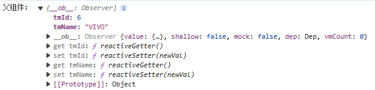

## 面包屑处理分类操作

找到面包屑模块，根据之前从仓库中获取的数据`searchParams`找到其中的面包屑数据，其中`categoryName`为面包屑标题。

```html
<div class="bread">
    <ul class="fl sui-breadcrumb">
        <li>
            <a href="#">全部结果</a>
        </li>
    </ul>
    <ul class="fl sui-tag">
        <li class="with-x" v-if="searchParams.categoryName">
            {{searchParams.categoryName}}
            <i>x</i>
        </li>

    </ul>
</div>
```

为了实现点击`x`实现删掉当前面包屑，添加一个点击事件`removeCategoryName`

```html
<div class="bread">
    <ul class="fl sui-breadcrumb">
        <li>
            <a href="#">全部结果</a>
        </li>
    </ul>
    <ul class="fl sui-tag">
        <li class="with-x" v-if="searchParams.categoryName">
            {{searchParams.categoryName}}
            <i @click="removeCategoryName">x</i>
        </li>

    </ul>
</div>
```

在`methods`中完善该方法。首先要将`searchParams`中的`id`和`categoryName`置空，然后再次向服务器发送请求，将当前的参数传递进去。这时会发现，地址栏部分还没变，还带有参数，于是再次进行路由跳转（自己跳转到自己）。

```js
/**
* 移除分类名称
* 把带给服务器的参数置空，还需要再向服务器发请求
 */
removeCategoryName() {

    // 带给服务器的参数是可有可无的，如果属性值为空的字符串，还是会将该属性发给服务器
    // 如果把相应的属性变为undefined，就不会再发送该参数给服务器了
    this.searchParams.category1Id = undefined;
    this.searchParams.category2Id = undefined;
    this.searchParams.category3Id = undefined;
    this.searchParams.categoryName = undefined;

    this.getSearchListByParams();

    // 地址栏也需要修改，进行路由跳转
    // 本意是删除query，如果路径中出现了params不应该删除，路由跳转的时候应该带着
    if (this.$route.params) {
        this.$router.push({name: 'search', params: this.$route.params})
    }
}
```


## 面包屑处理关键字

按照上述方式，在面包屑部分添加关键字，并附上点击事件`removeKeywords`，代码逻辑同上。

```vue
<template>
	 	 <div class="bread">
        <ul class="fl sui-breadcrumb">
            <li>
                <a href="#">全部结果</a>
        </li>
        </ul>
        <ul class="fl sui-tag">
            <!-- 分类的面包屑 -->
            <li class="with-x" v-if="searchParams.categoryName">
                {{searchParams.categoryName}}
                <i @click="removeCategoryName">x</i>
        </li>

            <!-- 关键字的面包屑 -->
            <li class="with-x" v-if="searchParams.keyword">
                {{searchParams.keyword}}
                <i @click="removeKeyword">x</i>
        </li>
        </ul>
    </div>
</template>

<script>
  import SearchSelector from './SearchSelector'
  import {mapGetters} from 'vuex'

  export default {
    name: 'SearchIndex',
    components: {
      SearchSelector
    	 },
    
    methods: {
      /**
       * 移除关键字
       */
      removeKeyword() {
        this.searchParams.keyword = undefined;

        this.getSearchListByParams();
          
        if (this.$route.query) {
          this.$router.push({name: 'search', params: this.$route.query})
        	 }
      	 }
    	 },
    }
  }
</script>
```

但是现在又有一个问题，在删除关键字面包屑后，搜索栏上的关键字还是存在，所以还要回到Header组件完善一下。

当面包屑中的关键字清除之后，需要让兄弟组件Header中的关键字清除，这就涉及到了组件间通信。

> # 组件通信
>
> - props：父给子
> - 自定义事件：子给父
> - vuex：仓库存储（万能）
> - 插槽：父给子
> - pubsub-js：万能
> - $bus：全局事件总线

配置全局事件总线：

```js
new Vue({
      render: h => h(App),
      beforeCreate() {
        Vue.prototype.$bus = this; //配置全局事件总线
      	 },

      // 注册路由
      router,

      // 注册仓库，组件实例对象中，$store属性，可以获取仓库
      store
  
}).$mount('#app')
```

通知兄弟组件Header清除关键字

```js
removeKeyword() {
    this.searchParams.keyword = undefined;

    this.getSearchListByParams();

    // 地址栏也需要修改，进行路由跳转
    // 本意是删除query，如果路径中出现了params不应该删除，路由跳转的时候应该带着
    if (this.$route.query) {
        this.$router.push({name: 'search', params: this.$route.query})
    }

    // 通知兄弟组件Header清除关键字
    this.$bus.$emit('removeSearchKeyword')
}
```

去Header组件，通过全局事件总线清除关键字

```js
mounted() {
    // 通过全局事件总线清除关键字
    this.$bus.$on('removeSearchKeyword', () => {
        this.keyword = '';
    })
},
```

这样就完成了。但是目前还是存在一个问题：当分类面包屑和关键词面包屑同时存在时，删掉关键词面包屑，会导致地址栏直接跳转回没带参数的Search页面，商品列表也会变回默认页面，但是面包屑部分其实还有分类面包屑存在。我们要实现的功能是删掉一个，另一个仍然显示，同时商品列表要和面包屑对应。

回到`removeKeyword`方法发现，是`this.$router.push({name: 'search', params: this.$route.query})`出现问题，应该改为`this.$router.push({name: 'search', query: this.$route.query});`

```js
removeKeyword() {
    this.searchParams.keyword = undefined;

    this.getSearchListByParams();

    if (this.$route.query) {
        this.$router.push({name: 'search', query: this.$route.query});
    	 }

    // 通知兄弟组件Header清除关键字
    this.$bus.$emit('removeSearchKeyword')
}
```


## 面包屑处理品牌信息

本模块要求点击品牌，会在面包屑中添加一个该品牌的面包屑，并更新商品列表。

首先回到`SearchSelector`组件，找到品牌列表，并添加处理品牌信息方法`addTrademarkToBread`。

```html
<div class="value logos">
    <ul class="logo-list">
        <li v-for="(trademark, index) in trademarkList" :key="trademark.tmId" 
            @click="addTrademarkToBread(trademark)">
            {{ trademark.tmName }}
        </li>
    </ul>
</div>
```

该方法要求：点击了该品牌，还需要整理参数，向服务器发送请求获取相应的数据。

因为父组件中`searchParams`参数是带给服务器参数的，子组件需要将点击的信息传递给父组件——自定义事件

所以需要回到父组件`Search`，给`<SearchSelector>`标签绑定一个自定义事件

```vue
<template>
    <!-- 
    @trademarkInfo="trademarkInfoMethod"：
    trademarkInfo是自定义事件名称，trademarkInfoMethod是自定义事件的回调函数名称 
    -->
    <SearchSelector @trademarkInfo="trademarkInfoMethod" />

</template>

<script>
    export default {
        name: 'SearchIndex',
        components: {
          SearchSelector
             },
        methods: {
            /**
             * 自定义事件回调
             */
            trademarkInfoMethod(trademark) {
                console.log('父组件：', trademark)
             }
        	 }
   	 }
</script>
```

同时在`SearchSelector`中`$emit`一下

```vue
<template>
    <div class="value logos">
        <ul class="logo-list">
            <li v-for="(trademark, index) in trademarkList" :key="trademark.tmId" 
                @click="addTrademarkToBread(trademark)">
                {{ trademark.tmName }}
            </li>
        </ul>
    </div>
</template>
<script>
    export default {
        name: 'SearchSelector',
        computed: {
          ...mapGetters(['trademarkList', 'attrsList'])
             },
        methods: {
          /**
           * 品牌的事件处理函数，添加该品牌的面包屑
           */
          addTrademarkToBread(trademark) {
            this.$emit('trademarkInfo', trademark) // 将选中的trademark传递给父组件
     	 	  }
    	 },
</script>
```

这时候，父组件`Search`已经拿到子组件`SearchSelector`传递过来的数据了，打印效果如下：



接下来，添加品牌信息的面包屑，将子组件传递过来的数据传递给父组件`Search`中`searchParams`的品牌信息`tradenark`，将其展现在页面上：

```vue
<template>
    <!-- 品牌的面包屑 -->
    <li class="with-x" v-if="searchParams.trademark">
        {{searchParams.trademark.split(':')[1]}}
        <i>x</i>
    </li>
    <!-- 
    @trademarkInfo="trademarkInfoMethod"：
    trademarkInfo是自定义事件名称，trademarkInfoMethod是自定义事件的回调函数名称 
    -->
    <SearchSelector @trademarkInfo="trademarkInfoMethod" />

</template>

<script>
    export default {
        name: 'SearchIndex',
        components: {
          SearchSelector
        	 },
        data() {
          return {
            // 带给服务器的参数
            searchParams: {
              // ...
              trademark: "" // 品牌信息
            	 }
          	 }
       	 },
        methods: {
            /**
             * 自定义事件回调
             */
            trademarkInfoMethod(trademark) {
                console.log('父组件：', trademark)
                // 整理品牌字段的参数
                this.searchParams.trademark = 
                    trademark.tmId ? `${trademark.tmId}: ${trademark.tmName}` : ""

                // 重新发送请求，获取search模块数据进行展示
                this.getSearchListByParams()
             }
        	 }
   	 }
</script>
```

同样，也需要在`x`上添加一个移除品牌信息的点击事件`removeTrademark`：

```vue
<template>
    <!-- 品牌的面包屑 -->
    <li class="with-x" v-if="searchParams.trademark">
        {{searchParams.trademark.split(':')[1]}}
        <i @click="removeTrademark">x</i>
    </li>
    <!-- 
    @trademarkInfo="trademarkInfoMethod"：
    trademarkInfo是自定义事件名称，trademarkInfoMethod是自定义事件的回调函数名称 
    -->
    <SearchSelector @trademarkInfo="trademarkInfoMethod" />

</template>

<script>
    export default {
        name: 'SearchIndex',
        components: {
          SearchSelector
        	 },
        data() {
          return {
            // 带给服务器的参数
            searchParams: {
              // ...
              trademark: "" // 品牌信息
            	 }
          	 }
       	 },
        methods: {
            /**
            	  	 * 删除品牌信息
            	  	 */
            removeTrademark() {
                this.searchParams.trademark = undefined;

                this.getSearchListByParams();
            }
        	 }
   	 }
</script>
```

此时就完成面包屑处理品牌信息功能了。


