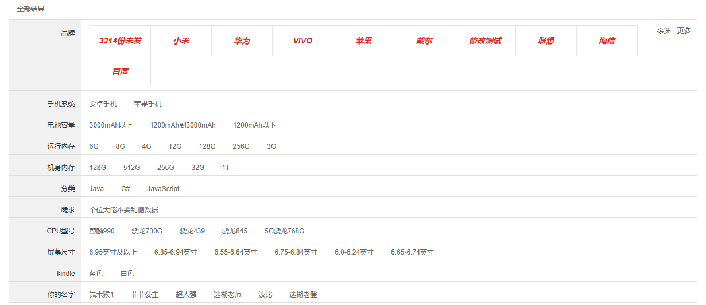

该模块要求：点击售卖属性后，添加对应售卖属性的面包屑，并跳转到对应显示界面，点击`x`删除面包屑，再次重新加载界面。


## SearchSelector组件

首先在`SearchSelector`组件中给每个售卖属性添加点击事件`addAttrInfoToBread`，将选中的平台售卖属性值`attrValue`传递给父组件

```vue
<template>
    <!-- 平台售卖属性 -->
    <div class="type-wrap" v-for="(attr, index) in attrsList" :key="attr.attrId">
        <div class="fl key">{{ attr.attrName }}</div>
        <div class="fl value">
            <ul class="type-list">
                <li v-for="(attrValue, index) in attr.attrValueList" :key="index"
                    @click="addAttrInfoToBread(attr, attrValue)"
                >
                    <a>{{ attrValue }}</a>
                </li>
            </ul>
        </div>
    </div>
</template>

<script>
 export default {
    name: "SearchSelector",
    computed: {
        ...mapGetters(["trademarkList", "attrsList"]),
    	 },
    methods: {
    /**
     *
     * @param attrValue 平台售卖属性值
     * @description 平台售卖属性值的点击事件处理函数，添加该属性值面包屑
     */
        addAttrInfoToBread(attr, attrValue) {
          this.$emit("attrInfo", attr, attrValue); // 将选中的attrValue传递给父组件
        	 },
	  	  	 	 },
};
</script>
```


## Search组件

回到父组件`Search`，在`SearchSelector`标签自定义事件`attrInfo`，并通过回调函数`attrInfoMethod`接收子组件传来的值，将该平台售卖属性值添加到面包屑。同时给`x`添加删除面包屑事件`removeAttrInfo`。

```vue
<template>
    <!-- 平台售卖属性的面包屑 -->
    <li 
        class="with-x"
        v-for="(attrValue, index) in searchParams.props"
        :key="index"
    >
        {{ attrValue.split(":")[1] }}
        <i @click="removeAttrInfo(index)">x</i>
    </li>
    <SearchSelector @trademarkInfo="trademarkInfoMethod" @attrInfo="attrInfoMethod"/>
</template>

<script>
import SearchSelector from "./SearchSelector";
import { mapGetters } from "vuex";

export default {
    name: "SearchIndex",
    components: {
        SearchSelector,
    },
    computed: {
        ...mapGetters(["goodsList", "trademarkList", "attrsList"]),
    },
    methods: {
        /**
         * @param attr 平台售卖属性
         * @param attrValue 平台售卖属性值
         * @description 平台售卖属性值的点击事件处理函数，添加该属性值面包屑
         */
        attrInfoMethod(attr, attrValue) {
            // 整理数据
            let prop = `${attr.attrId}: ${attrValue}: ${attr.attrName}`;

            // 数组去重
            if (this.searchParams.props.indexOf(prop) == -1) {
                this.searchParams.props.push(prop);
            }

            // 再次发送请求
            this.getSearchListByParams();
        },
       /**
         * @description 删除平台售卖属性值面包屑
         * @param attrIndex 属性id
         */
        removeAttrInfo(attrIndex) {
          this.searchParams.props.splice(attrIndex);
          this.getSearchListByParams();
        }
    },
};
</script>
```

